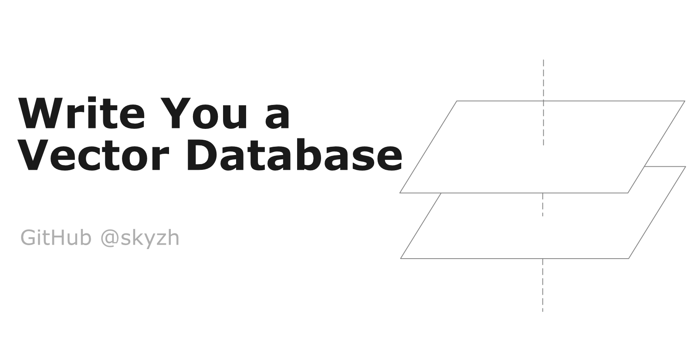

# Write You a Vector Database

A tutorial on how to add vector capabilities to a relational database system.

Access the tutorial at [https://skyzh.github.io/write-you-a-vector-db](https://skyzh.github.io/write-you-a-vector-db).

Join the write-you-a-vector-db community: 

We plan to release two variants of this tutorial: a C++ version and a Rust version.

In the C++ version, you will implement pgvector-like capabilities on a modified version of CMU-DB's [BusTub](https://github.com/cmu-db/bustub) educational database system. You will implement vector storage, vector expressions, and vector indexes over BusTub.

In the to-be-expected Rust version, you will implement vector capabilities over the [RisingLight](https://github.com/risinglightdb/risinglight) educational database system.
