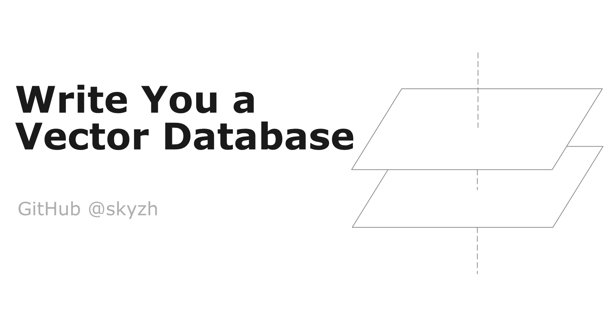

# Write You a Vector Database

Write You a Vector Database is being redesigned as a one-week, Rust-first hands-on course. The new course will build a
small vector search engine as a Rust library and integrate it with SQL through a thin DataFusion adapter.

The redesigned course is not runnable yet. The book currently contains the proposed architecture and one-week learning
path so that the scope can be reviewed before a new starter repository and reference checkpoints are created.

Read the course at [https://skyzh.github.io/write-you-a-vector-db](https://skyzh.github.io/write-you-a-vector-db).

## Legacy C++ Edition

The original BusTub-based C++ course remains in the book as an unmaintained legacy edition. Its starter and solution
submodules are preserved for existing readers, but new course development will focus on Rust.

## Community

You may join skyzh's Discord server and study with the write-you-a-vector-db community.

## License

The BusTub vector-db starter code and solution are under the MIT license. Some files overlap with CMU's Database Systems
course and must not be made public. The author reserves the full copyright of the book's Markdown files and figures.
