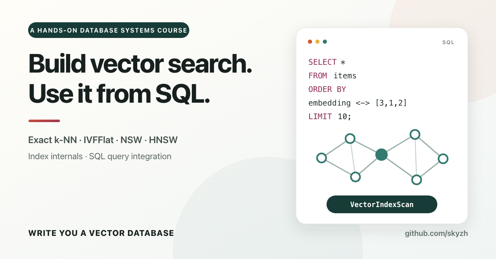

# Build Vector Search Inside a SQL Database

Write You a Vector Database is a short hands-on course for systems and backend engineers. You will build a small in-memory
vector database in Rust, start by running exact nearest-neighbor queries, and then add approximate indexes. The system will
answer SQL top-k queries through DataFusion and make the tradeoff between recall, latency, and memory visible.

**Course status:** All five chapters are ready to implement: an in-memory Arrow table and DataFusion optimizer rule,
followed by IVFFlat, NSW, HNSW, and a shared recall and latency benchmark. An optional sixth chapter adds residual product
quantization and exact reranking. The repository includes starter code, focused tests, and separate completed references.

The original 2024 C++/BusTub course is preserved as a
[deprecated, unmaintained edition](./cpp-01-overview.md). It is no longer the recommended path for new learners.

## Why Build a Vector Database?

Embeddings turn text, images, and other data into fixed-dimensional vectors. A vector database stores those vectors and
retrieves the items closest to a query vector under a distance metric. Exact search compares the query with every stored
vector. Approximate nearest-neighbor (ANN) indexes avoid much of that work in exchange for returning an imperfect result
set.

This course builds vector search as a database feature rather than as an isolated ANN library. You will explore IVFFlat
and graph indexes while seeing how vectors, distance expressions, query planning, execution, and indexes fit together
behind one SQL top-k query.

## What You Will Build

The five Rust chapters build:

1. An Arrow-backed vector table and a conservative DataFusion optimizer rule that selects a vector-index scan.
2. An IVFFlat index and recall harness that compare approximate results with exact search.
3. An NSW proximity graph with bounded reciprocal edges and adjustable search width.
4. An HNSW hierarchy that routes through sparse upper layers before searching the complete graph.
5. A benchmark that compares exact, IVFFlat, NSW, and HNSW search on the same deterministic workload.

An optional follow-up compresses IVFFlat's candidate-scoring representation with product quantization, then measures the
resulting storage, recall, and latency tradeoff.

At its core, this is a regular Rust library. You will build a DataFusion adapter that recognizes a safe SQL top-k query and
routes it to a vector index. The collection and indexes stay independent of Arrow and the query engine, so you can explore
each layer on its own and then see them work together.

## Learning Goals

After completing the course, you should be able to:

- define the semantics and edge cases of Euclidean, cosine, and inner-product search;
- preserve each row's identity when converting vectors into Arrow arrays and a DataFusion `TableProvider`;
- explain how IVFFlat and graph indexes trade build cost, memory, latency, and recall;
- design benchmarks that compare ANN results with exact-search results;
- recognize when a SQL top-k query can safely use an approximate index; and
- separate a storage and search engine from its SQL interface.

## What This Course Will Not Cover

You will not implement embedding models, persistent index files, online updates or deletes after an index is built, crash
recovery, filtered ANN search, distributed execution, GPU kernels, or an HTTP service. You will implement the course's
indexes directly instead of calling an existing ANN library.

Those boundaries keep the course focused on vector search. They also make every required component small enough to test,
measure, and explain.

## Prerequisites

You should be comfortable with Rust ownership, traits, error handling, iterators, and Cargo. You should also know basic
database concepts such as records, indexes, SQL ordering, and query plans.

Prior knowledge of nearest-neighbor algorithms, Apache Arrow, or DataFusion is not required. Chapter 1 introduces the small
subset of DataFusion's extension interface used by the course.

## How to Use This Book

Start with the [Rust course](./rust-01-overview.md). It defines the architecture, system contract, starter workspace,
progression, and scope. Each available chapter pairs the book with starter code, focused tests, and a separate reference
solution.

Each implementation chapter begins with a concrete goal, the relevant invariants, and a small prediction exercise. It ends
with focused tests and a short reflection on what you observed.

Chapter 1 makes the table and optimizer rule runnable. Chapter 2 compares IVFFlat with exact search, Chapter 3 follows
graph edges with NSW, and Chapter 4 adds sparse HNSW layers. Chapter 5 compares all four indexes under one measurement
contract. The optional Chapter 6 adds product quantization after you have a full-precision benchmark baseline. Every
approximate index uses the same collection API, so you can compare algorithms without changing the core search contract.

## Community

Join skyzh's Discord server to study with the write-you-a-vector-db community.

## About the Author

Chi is a database systems engineer and the author of [Mini-LSM](https://skyzh.github.io/mini-lsm/) and
[LLM Serving in a Week](https://skyzh.github.io/tiny-llm/). He has worked on storage and database systems including TiKV,
AgateDB, TerarkDB, RisingWave, Neon, and RisingLight, and served as a teaching assistant for CMU's Database Systems course.

This course is not affiliated with Carnegie Mellon University or the CMU-DB Group. The deprecated C++ edition is not part
of CMU's 15-445/645 Database Systems course.

{{#include copyright.md}}
