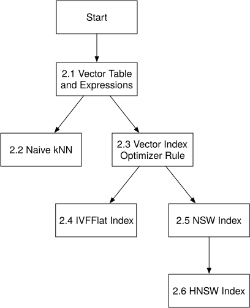

# C++ Course over BusTub (Deprecated)

{{#include cpp-deprecation.md}}

In this edition, you will add vector search to a modified version of BusTub, CMU's educational database system. The index
chapters build from IVFFlat through one-layer NSW to hierarchical HNSW. The SIFT1M chapter is an optional benchmark
capstone for comparing IVFFlat and HNSW.

## Course Order

Follow the chapters in order:

1. implement vector distances, insertion, and sequential scan;
2. implement exact k-nearest-neighbor queries with sort, limit, and Top-N;
3. match a safe SQL top-k query to a compatible vector index;
4. implement IVFFlat;
5. implement a one-layer NSW graph;
6. extend NSW into a hierarchical HNSW index; and
7. benchmark IVFFlat and HNSW on SIFT1M.

The diagram shows the same algorithm dependencies through HNSW. It is useful as a map, but it does not make the chapters
independent.



## Environment Setup

Use the course's frozen BusTub snapshot. These chapters and the SIFT1M benchmark were checked against commit
`b9799536dfb054cd616d781d8801616c7812fb2b`.

```shell
git clone https://github.com/skyzh/bustub-vectordb
cd bustub-vectordb
git checkout b9799536dfb054cd616d781d8801616c7812fb2b
```

The intended environments are Ubuntu 22.04 and macOS. Follow the starter repository's **Build** section to install its
platform packages. The project uses CMake, C++17, and LLVM/Clang 14. Use LLVM/Clang 14 even if your Mac already has a
newer Apple Clang. Newer compilers warn about deprecated code in the starter's 2024 dependencies, and the starter treats
those warnings as build errors.

From the `bustub-vectordb` directory, create a build directory:

```shell
mkdir build
cd build
```

On Ubuntu, configure with Clang 14:

```shell
cmake -DCMAKE_POLICY_VERSION_MINIMUM=3.5 \
  -DCMAKE_C_COMPILER=clang-14 \
  -DCMAKE_CXX_COMPILER=clang++-14 \
  ..
```

On macOS with Homebrew's `llvm@14`, configure with:

```shell
cmake -DCMAKE_POLICY_VERSION_MINIMUM=3.5 \
  -DCMAKE_C_COMPILER="$(brew --prefix llvm@14)/bin/clang" \
  -DCMAKE_CXX_COMPILER="$(brew --prefix llvm@14)/bin/clang++" \
  ..
```

Then build the two course binaries:

```shell
make -j8 shell sqllogictest
```

The policy option lets the starter's older vendored CMake projects configure under CMake 4. Unless a chapter creates a
separate build directory, later build and test commands assume that your working directory is `bustub-vectordb/build`.

Run the SQL shell:

```console
$ ./bin/bustub-shell
bustub> SELECT ARRAY [1.0, 2.0, 3.0];
+-------------+
| __unnamed#0 |
+-------------+
| [1,2,3]     |
+-------------+
```

In this starter, an `ARRAY` expression becomes a vector only when every element is a decimal literal such as `1.0`.
Integer literals such as `1` are outside the required path.

## What the Starter Adds

The starter narrows BusTub to the parts used by this course:

- **In-memory table storage.** A modified table heap and buffer pool keep the course data in memory.
- **Vector expressions.** The parser, type system, and expression tree already recognize three vector-distance operations.
- **Vector-index interfaces.** `VectorIndex`, `IVFFlatIndex`, and `HNSWIndex` connect index construction, insertion, and lookup.
- **Vector-index execution.** A plan node and executor can turn ordered vector-index RIDs back into table tuples.
- **SIFT1M benchmark harness.** An optional executable loads the standard 128-dimensional corpus, runs HNSW queries, and
  reports 1-nearest-neighbor recall at ranks 1, 10, and 100.

Some executor work overlaps with CMU's Database Systems assignments. **KEEP PRIVATE** applies only to files marked with
that label: do not commit or publish your implementations of those paths. The vector-index and benchmark files are not
part of that restriction. Because the starter already tracks placeholder versions of some private files, `.gitignore`
alone will not hide changes to them; check the staged diff before publishing.

## How to Check Each Chapter

The `vector.*.slt` files use `statement ok`, so they mainly prove that a statement ran without an error. Their verbose
output is an inspection aid, not a complete correctness oracle. Where a stricter BusTub SQLLogicTest exists, the chapter
names it. For every checkpoint, also explain:

- how a tuple or query moves through the code you changed;
- the invariant that keeps its result correct;
- one input that could break a careless implementation; and
- which test would expose that failure.

{{#include copyright.md}}
