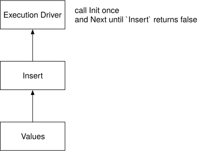

# Vector Expressions and Storage

{{#include cpp-deprecation.md}}

This checkpoint makes the smallest end-to-end vector query work. You will implement the three distance functions, insert
rows into the table and any vector indexes on it, and scan the rows back out.

Files you will likely modify:

```text
src/execution/insert_executor.cpp                    (KEEP PRIVATE)
src/execution/seq_scan_executor.cpp                  (KEEP PRIVATE)
src/include/execution/executors/insert_executor.h    (KEEP PRIVATE)
src/include/execution/executors/seq_scan_executor.h  (KEEP PRIVATE)
src/include/execution/expressions/vector_expression.h
```

<div class="warning">

The simplified insert and sequential-scan executors overlap with CMU's Database Systems assignments. **KEEP PRIVATE**
means that you must add those four paths to your solution repository's `.gitignore` and must not commit or publish them.
The starter already tracks placeholder versions of these files, so adding them to `.gitignore` inside the starter clone is
not enough to hide your changes. Keep the entire clone private.

</div>

## Checkpoint 1: Compute Distances

Before coding, consider `a = [1, 0]` and `b = [0, 1]`. Their L2 distance is `sqrt(2)`, their cosine distance is `1`, and
their negative inner-product distance is `0`. These examples make the sign and ordering contract visible: for all three
operations in this course, a smaller value is a better match.

Implement `ComputeDistance` in `src/include/execution/expressions/vector_expression.h`:

**L2 distance (Euclidean distance)**

\\( \lVert \mathbf{a} - \mathbf{b} \rVert = \sqrt {(a_1 - b_1)^2 + (a_2 - b_2)^2 + \cdots + (a_n - b_n)^2} \\)

**Cosine distance**

\\( 1 - \frac { \mathbf{a} \cdot \mathbf{b} } {\lVert \mathbf{a} \rVert \lVert \mathbf{b} \rVert} \\)

**Negative inner-product distance**

\\( - \mathbf{a} \cdot \mathbf{b} = - (a_1 b_1 + a_2 b_2 + \cdots + a_n b_n) \\)

**Course rule:** Inputs have equal dimensions. The starter asserts this invariant. Cosine-distance inputs in the required
tests also have nonzero norms; if you extend the system to accept zero vectors, reject them or define their behavior
explicitly instead of relying on division by zero.

## Checkpoint 2: Insert and Scan Rows

### How BusTub Stores a Row

A `TableHeap` is page-organized row storage. The original BusTub abstraction is disk-oriented, but this course's modified
buffer pool keeps its pages in memory.

A `Tuple` is the serialized form of one row. On the intended little-endian machines, three `INTEGER` values `1, 2, 3` use
four bytes each:

```text
01 00 00 00  02 00 00 00  03 00 00 00
```

The bytes alone do not identify their types. A `Schema` supplies the number, order, and type of the columns so BusTub can
decode them. The three relevant representations are:

- `Tuple`: serialized row bytes;
- `Schema`: the position and type of each column; and
- `Value`: an in-memory typed value, such as an integer or `std::vector<double>`.

*Related lecture:* [Database Storage Part 2 (CMU Intro to Database Systems)](https://www.youtube.com/watch?v=Ra50bFHkeM8&list=PLSE8ODhjZXjbj8BMuIrRcacnQh20hmY9g&index=5)

### Execution Model

BusTub uses the Volcano execution model. Each executor has `Init` and `Next` methods. The execution engine calls `Init`
once, then calls `Next` until it returns `false`. An executor initializes its child before pulling tuples from it.



*Related lectures:*

- [Query Execution Part 1 (CMU Intro to Database Systems)](https://www.youtube.com/watch?v=3F3FWgujN9Q&list=PLSE8ODhjZXjbj8BMuIrRcacnQh20hmY9g&index=13)
- [Query Execution Part 2 (CMU Intro to Database Systems)](https://www.youtube.com/watch?v=MUjS0tIDnEE&list=PLSE8ODhjZXjbj8BMuIrRcacnQh20hmY9g&index=14)

### Insert Executor

Run this statement in `bustub-shell` to inspect the insert plan directly:

```sql
EXPLAIN (o) INSERT INTO t1 VALUES (ARRAY [1.0, 2.0, 3.0]);
```

An `INSERT` plan pulls rows from a child `Values` executor:

```text
Insert { table_oid=24 }
  Values { rows=1 }
```

Initialize `plan_`, `child_executor_`, `table_heap_`, and the table's vector-index list from the executor context. The
catalog returns every index on the table, so keep only indexes whose implementation can be dynamically cast to
`VectorIndex *`.

**Course rules:**

- `Init` initializes the child, consumes all of its tuples, and inserts each tuple into the table heap.
- Update a vector index only after the table insert succeeds and returns an RID.
- A vector index has exactly one key attribute in this course. Use that column position to read a `Value`, call
  `Value::GetVector`, and pass the vector and the inserted RID to `InsertVectorEntry`.
- `Next` emits one tuple containing the number of inserted rows, then returns `false` on later calls.

The verbose vector reference happens to show `0` for `INSERT` because its `statement ok` records do not assert the result.
That output is not the executor contract. The focused `p3.02-insert.slt` test checks the row count.

### Sequential Scan Executor

Initialize `plan_` and `table_heap_` from the table OID. In `Init`, create a `TableIterator` with `MakeIterator`. In each
successful `Next` call:

1. read the current `(TupleMeta, Tuple)` pair with `TableIterator::GetTuple`;
2. copy both the tuple and `TableIterator::GetRID()` to the output parameters; and
3. advance the iterator exactly once.

Return `false` immediately when `TableIterator::IsEnd()` is true. The required course path is append-only, so it does not
ask this simplified scan to skip deleted tuples.

## Verify the Checkpoint

From `bustub-vectordb/build`, build and run the vector checkpoint:

```shell
make -j8 sqllogictest
./bin/bustub-sqllogictest ../test/sql/vector.01-insert-scan.slt --verbose
```

Compare the distance and scan rows with the reference below:

<details>

<summary>Reference Test Result</summary>

```text
{{#include vector.01-insert-scan.slt.ref}}
```

</details>

Then run the stricter executor checks, which assert rows and insert counts:

```shell
./bin/bustub-sqllogictest ../test/sql/p3.01-seqscan.slt
./bin/bustub-sqllogictest ../test/sql/p3.02-insert.slt
```

Predict before testing: what should `Next` do for an empty table, and what would break if an index received a different
RID from the one returned by `InsertTuple`?

You are done when you can trace an input vector from `ValuesExecutor`, through tuple storage and `InsertVectorEntry`, and
back through `SeqScanExecutor`, and explain how the schema and RID preserve its meaning and identity.

## Bonus Tasks

### Implement the Buffer Pool Manager

The starter provides a mock buffer pool manager and a modified table heap, so the required course path keeps all data in
memory. As a bonus, you can replace them with the persistent buffer pool manager from
[project 1](https://15445.courses.cs.cmu.edu/fall2023/project1/) of CMU 15-445/645. Revert both the starter's buffer-pool
change and its table-heap change before beginning; reverting only one side can cause memory leaks and deadlocks.

### Implement Delete and Update

Implement the delete and update executors so they update both the table heap and every vector index. BusTub marks deleted
tuples instead of immediately removing their storage, so use `UpdateTupleMeta` for deletion and model an update as a
deletion followed by an insertion. You will also need to extend `VectorIndex` with a way to remove entries.

### Validate Inserts

Add dimension validation before inserting into a `VECTOR(n)` column. For example, reject a vector of dimension 3 or 5
when the column is declared as `VECTOR(4)`.

These tasks overlap further with CMU's Database Systems projects. **KEEP PRIVATE** applies to every implementation in this
section: add the affected files to your solution repository's `.gitignore`, do not commit or publish them, and keep the
entire starter clone private because its placeholder files are already tracked.

{{#include copyright.md}}
