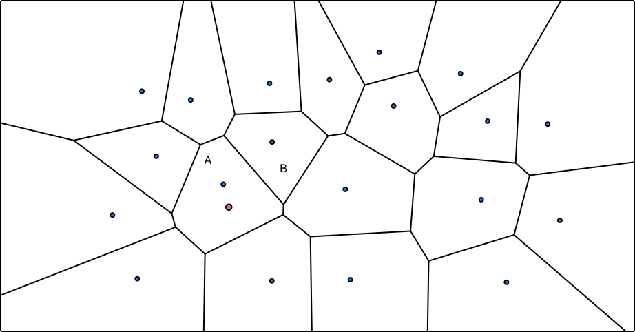

# IVFFlat (Inverted File Flat) Index

{{#include cpp-deprecation.md}}

IVFFlat is a simple quantization-based vector index that splits data into buckets to accelerate vector similarity search.
A query probes only the nearest buckets, reducing distance calculations at the cost of possibly missing a true neighbor.

Complete the exact-search and optimizer chapters first. You will likely modify:

```text
src/include/storage/index/ivfflat_index.h
src/storage/index/ivfflat_index.cpp
```

*Related reading:* [IVF visualization in Pinecone's Faiss guide](https://www.pinecone.io/learn/series/faiss/product-quantization/)

## How IVFFlat Works

IVFFlat builds `lists` clusters over vectors already stored in the table. Each cluster has a centroid and a list of the
vectors closest to that centroid. At lookup time, the index compares the query with the centroids first, then searches
only `probe_lists` nearby lists instead of every vector. Searching less data makes the query faster, but skipping lists
can miss a true neighbor, so IVFFlat returns approximate nearest neighbors.

## Build the Lists

The checkpoint creates an IVFFlat index after the table already contains data. `lists` is the number of centroids and
`probe_lists` is the number of centroid lists searched per query.

The first diagram shows the vectors before the index exists. They all belong to one unpartitioned data set, so an exact
query would compare its target with every point.


When the user creates the index, K-means chooses `lists` initial centroids and alternates between assigning vectors to
their nearest centroid and moving each centroid to the mean of its assigned vectors. In the second diagram, each colored
centroid represents one future list. A boundary in the Voronoi diagram marks positions equally distant from the two
centroids on either side.


Once the centroids are fixed, visit every stored vector and place `(vector, RID)` in the list for its nearest centroid
under `distance_fn_`. The third diagram shows the resulting buckets: vectors in the same region will be searched
together.


<small>Diagram generated with [websvg.github.io/voronoi](https://websvg.github.io/voronoi/) and edited with OmniGraffle.</small>

**Course rules:**

- Require `1 <= lists <= initial_data.size()` and `1 <= probe_lists <= lists` for a usable index.
- Build data stores each vector together with its RID.
- Every distance comparison uses the index's `distance_fn_`.
- If a K-means cluster is empty, retain its previous centroid for that iteration. Never divide by zero or silently remove
  a list.
- The required IVFFlat checkpoint is not usable when built on an empty table. `BuildIndex` may return for empty input, but
  later insertion into that untrained index is outside the supported path.

A fixed number of iterations, such as 500, is acceptable. Stopping after convergence is also valid. A fixed random seed
makes debugging repeatable; a nondeterministic seed is allowed, so exact approximate results may differ.

```text
centroids = sample_distinct(initial_data, lists)
repeat up to 500 times:
    buckets = one empty bucket per centroid
    for (vector, rid) in initial_data:
        bucket_id = nearest_centroid(vector, centroids, distance_fn)
        buckets[bucket_id].append((vector, rid))

    for each bucket_id:
        if buckets[bucket_id] is not empty:
            centroids[bucket_id] = component_wise_mean(buckets[bucket_id].vectors)

rebuild buckets once using the final centroids
```

The final rebuild matters: otherwise the stored memberships describe the previous centroids rather than the centroids you
return.

## Insert a New Vector

Insertion finds the nearest existing centroid and appends `(vector, RID)` to that list. It does not retrain K-means.



In the diagram, the red vector is closest to centroid A, so insertion adds it to list A. The centroid stays where it was;
the index does not rerun K-means for each row. This makes insertion cheap, but a changed data distribution can make the
old centroids poor. Rebuilding is an operational choice, not part of this checkpoint.

## Look Up Neighbors

The red vector in the next diagram is a query asking for its five nearest neighbors. If lookup searches only its nearest
centroid's list A, it can return five candidates from A, but some points just across the boundary in list B are actually
closer to the query.


Probing both A and B exposes those candidates. Lookup computes distances within both lists, combines their local
candidates, and keeps the best five overall. Increasing `probe_lists` repeats this idea across more nearby buckets: it
does more work, but it is less likely to miss a true neighbor.


Implement `ScanVectorKey(base_vector, limit)` as follows:

1. return an empty result for `limit = 0`;
2. find the `probe_lists_` nearest centroids;
3. evaluate the vectors in those lists;
4. retain the best `limit` candidates across all probed lists; and
5. return their RIDs sorted from smallest to largest distance.

The vector-index scan executor trusts this order and does not sort again. Returning the right RIDs in heap order is
therefore incorrect.

You may keep a local top-k result per list and merge those results, or feed all probed candidates into one bounded heap.
Both choices preserve the contract.

**Prediction:** If the query is just across the boundary from its nearest centroid, what happens to recall when
`probe_lists` changes from `1` to `2`? Which part of the lookup code should change, and which parts should not?

## Verify the Checkpoint

From `bustub-vectordb/build`, run:

```shell
make -j8 sqllogictest
./bin/bustub-sqllogictest ../test/sql/vector.04-ivfflat.slt --verbose
```

Confirm that `EXPLAIN` contains `VectorIndexScan`, inserts after index construction are searchable, the result has at most
`LIMIT` rows, and distances are nondecreasing. Random initialization can change which approximate rows appear.

<details>

<summary>Reference Test Result</summary>

```text
{{#include vector.04-ivfflat.slt.ref}}
```

</details>

For an adversarial check, run the same query once with `SET vector_index_method=none` and once with
`SET vector_index_method=ivfflat`. Treat exact Top-N as the oracle: every returned IVFFlat RID must exist, while overlap
with the exact top-k measures recall.

You are done when you can explain why the final bucket rebuild is necessary, how `(vector, RID)` flows from index build to
table lookup, and how increasing `probe_lists` trades work for recall.

## Optional Extensions

- Implement Elkan's accelerated K-means algorithm.
- Add an explicit index-rebuild operation.
- Add deletion and update interfaces.
- Design a persistent layout after restoring the full buffer-pool path.

{{#include copyright.md}}
