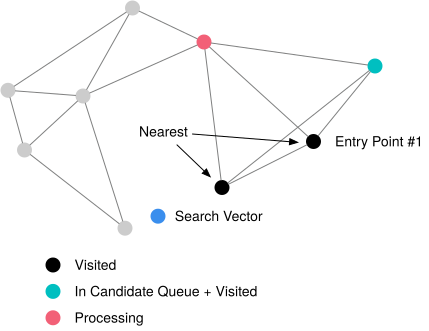

# NSW (Navigable Small Worlds) Index

{{#include cpp-deprecation.md}}

This chapter implements the last fully specified checkpoint in the C++ course: a one-layer navigable small-world graph.
The starter represents that graph as `layers_[0]` inside `HNSWIndex` so the next, optional chapter can add hierarchy.

Complete the previous chapters first. You will likely modify:

```text
src/include/storage/index/hnsw_index.h
src/storage/index/hnsw_index.cpp
```

*Related readings:*

- [Efficient and robust approximate nearest neighbor search using Hierarchical Navigable Small World graphs](https://arxiv.org/abs/1603.09320)
- [HNSW in Pinecone's Faiss guide](https://www.pinecone.io/learn/series/faiss/hnsw/)

## Search One Layer

For one nearest neighbor and one entry point, search walks to neighbors that are closer to the target. Because the graph is
approximate, this walk can stop at a local minimum.


For k-nearest-neighbor search, maintain:

- `C`, a min-heap of candidates to explore, with the nearest candidate on top;
- `W`, a max-heap of the best visited candidates, with the worst retained result on top; and
- `visited`, a set that prevents repeated graph expansion.

Seed all three structures from the entry points.


Pop the nearest candidate, visit each unseen neighbor, and add a promising neighbor to both queues. Keep at most the
requested search width in `W`.


Stop when the nearest remaining candidate in `C` is farther than the worst result in a full `W`.


```text
C = entry_points as a min-heap by distance
W = unique entry_points as a max-heap by distance
visited = unique entry_points

while C is not empty:
    candidate = C.pop_nearest()
    if W is full and distance(candidate) > distance(W.worst):
        break

    for neighbor in candidate.neighbors:
        if neighbor is already visited:
            continue
        mark neighbor visited
        if W is not full or distance(neighbor) < distance(W.worst):
            C.push(neighbor)
            W.push(neighbor)
            trim W to the search width

return W sorted from nearest to farthest
```

Multiple entry points can reach a region that one entry point misses:



**Course rules for `NSW::SearchLayer`:**

- return an empty vector for `limit = 0`, no entry points, or an empty layer;
- ignore duplicate entry-point IDs and never visit a vertex more than once;
- use `dist_fn_` for every comparison; and
- return at most `limit` vertex IDs, sorted from nearest to farthest.

## Insert into the Graph

To insert a vector, search for `ef_construction` candidates, select the nearest `m`, and connect the new vertex to them.


`NSW::Connect` creates an undirected edge. Adding the new edges can put an existing vertex over the layer's `m_max_` cap.


Re-select that vertex's nearest `m_max_` neighbors.


Remove every rejected edge from both endpoints so the graph remains undirected.


**Course rules for insertion:**

- The first vertex is added without searching or connecting.
- Do not create self-edges or duplicate edges.
- Keep `edges_[a]` and `edges_[b]` symmetric after both connection and pruning.
- `SelectNeighbors` returns at most `m` unique IDs ordered by `dist_fn_`.
- Add the new vertex to the layer exactly once.

The starter parameters mean:

- `m_`: how many neighbors a new vertex selects;
- `ef_construction_`: the insertion-search width;
- `ef_search_`: the query-search width;
- `m_max_`: the upper-layer degree cap reserved for HNSW; and
- `m_max_0_`: the layer-0 degree cap. The starter derives it as `m_ * m_` and assigns it to `layers_[0].m_max_`.

Require `m > 1`, `ef_construction >= m`, and `ef_search >= 1`. The first condition also keeps the starter's
`m_l_ = 1 / log(m)` finite for the optional HNSW extension.

For a SQL `LIMIT k`, search layer 0 with width `max(k, ef_search_)`, then select and return the nearest `k` RIDs. This
ensures that a request for more than `ef_search_` rows can still return `k` rows, while a larger `ef_search_` can improve
recall.

## Verify the Checkpoint

From `bustub-vectordb/build`, run:

```shell
make -j8 sqllogictest
./bin/bustub-sqllogictest ../test/sql/vector.05-hnsw.slt --verbose
```

Confirm that results are sorted by distance, inserts after index construction are searchable, and the `LIMIT 5` query can
return five rows even though the test index uses `ef_search = 3`. Random build order can change tie ordering.

<details>

<summary>One-Layer NSW Reference</summary>

```text
{{#include vector.05-hnsw.slt.1.ref}}
```

</details>

Also compare an NSW query with `SET vector_index_method=none`. Exact Top-N is the oracle for recall, not a requirement that
every approximate result match.

**Prediction:** If the graph has two disconnected components and every entry point is in the first component, can
`SearchLayer` return a vertex from the second? Explain why the `visited` and stop-condition code cannot repair missing
connectivity.

You are done when you can trace one vertex ID through `vertices_`, `layers_[0].edges_`, `rids_`, and the table lookup, and
explain what would break if pruning removed only one side of an undirected edge.

## Optional Extensions

- Implement the paper's heuristic neighbor-selection rule.
- Add deletion and update support.
- Persist the graph after defining a stable on-disk layout.

{{#include copyright.md}}
