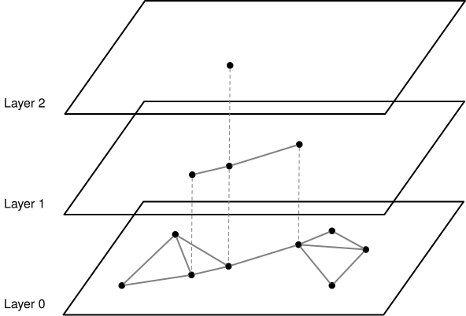
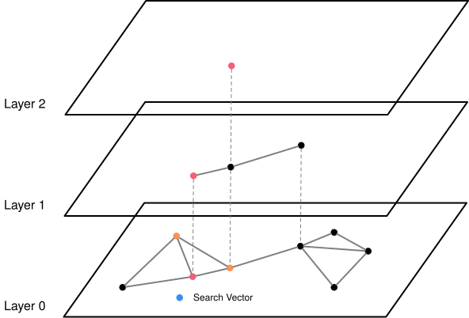
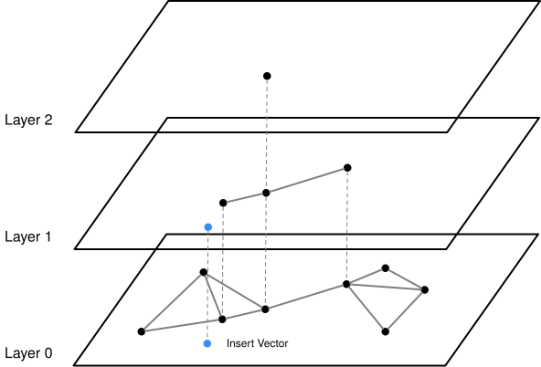
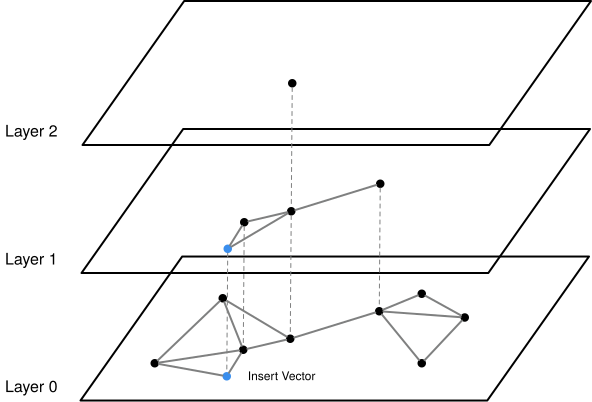

# HNSW (Hierarchical Navigable Small Worlds) Index (WIP)

{{#include cpp-deprecation.md}}

The starter has fields for multiple NSW layers. In this chapter, you will use them to add hierarchy to the graph and make
search more efficient, much like a skip list or mipmap. Sparse upper layers make long jumps; layer 0 still contains every
vertex and produces the final candidates.

Files you will likely modify:

```text
src/include/storage/index/hnsw_index.h
src/storage/index/hnsw_index.cpp
```

*Related readings:*

- [Efficient and robust approximate nearest neighbor search using Hierarchical Navigable Small World graphs](https://arxiv.org/abs/1603.09320)
- [HNSW in Pinecone's Faiss guide](https://www.pinecone.io/learn/series/faiss/hnsw/)

## How Hierarchy Works

Layer 0 contains every vector. Each higher layer contains a progressively smaller random subset, much like the sparse
levels of a skip list or the lower-resolution levels of a mipmap. Search starts in the sparsest top layer, where one edge
can cross a large part of the data set, then carries the nearest vertex found there down as the entry point to the next
layer. Layer 0 performs the final k-nearest-neighbor search.



The diagram shows the same vector IDs repeated across nested layers. A vertex that appears in an upper layer must also
appear in every layer below it. Sparse upper-layer edges provide long jumps; denser lower-layer edges refine the search
around the query.

## Layer Invariants

Your implementation should preserve these rules:

- layer 0 contains every vertex;
- membership is nested: a vertex in layer `L` also appears in every lower layer;
- each layer stores global vertex IDs into `vertices_` and `rids_`;
- upper layers use `m_max_`, while layer 0 uses `m_max_0_`;
- edges remain symmetric within each layer; and
- the top entry point belongs to the current highest nonempty layer.

The starter header has no dedicated top-entry-point field. You may add one, or derive it consistently from the highest
layer. That representation is your choice; the invariants are not.

## Lookup



In the lookup diagram, search begins at the entry point in the highest layer. A width-1 greedy search finds that layer's
nearest vertex to the query; that vertex becomes the entry point for the layer below. Repeat this descent through each
upper layer. At layer 0, widen the search to `max(k, ef_search_)` candidates and return the nearest `k` RIDs in distance
order. The upper layers navigate quickly; layer 0 produces the result.

```text
entry_points = [top_entry_point]
for level from highest_level down to 1:
    entry_points = layers[level].search(target, limit=1, entry_points)

candidates = layers[0].search(
    target,
    limit=max(k, ef_search),
    entry_points=entry_points,
)
return nearest k candidates
```

Return an empty result for an empty index or `k = 0`; do not call `DefaultEntryPoint()` on an empty layer.

## Insertion

Draw a random `U` strictly greater than zero and compute
\\( \text{level} = \lfloor -\ln(U) \times m_L \rfloor \\). The starter sets
\\( m_L = 1 / \ln(m) \\), which requires `m > 1`.

Suppose the random level is 1, as in the first diagram. The new vector belongs to layers 1 and 0, but not to layer 2.
This random promotion is what makes higher layers progressively sparser.



Start at the current top layer and use width-1 searches until reaching the new vector's highest target layer. At that
layer and every layer below it, search `ef_construction_` candidates, select the nearest `m_`, connect the new vertex, and
prune both sides of rejected edges. The second diagram follows those connections down through the layers that contain the
new vector.



```text
if the index is empty:
    create layers 0 through target_level
    add the first vertex to every layer
    make it the top entry point
    return

entry_points = [top_entry_point]
for level from current_highest down to target_level + 1:
    entry_points = layers[level].search(target, limit=1, entry_points)

for level from min(current_highest, target_level) down to 0:
    candidates = layers[level].search(target, ef_construction, entry_points)
    neighbors = nearest m candidates
    add the new vertex to this layer and connect it to neighbors
    prune overfull endpoints while preserving symmetric edges
    entry_points = candidates

if target_level is above current_highest:
    create each missing upper layer with only the new vertex
    make the new vertex the top entry point
```

This outline still leaves engineering choices such as random seeding and helper layout to the implementer. Refer to the
paper for the complete algorithm.

## Verify the Checkpoint

From `bustub-vectordb/build`, run the same SQLLogicTest used in the NSW chapter:

```shell
make -j8 sqllogictest
./bin/bustub-sqllogictest ../test/sql/vector.05-hnsw.slt --verbose
```

<details>

<summary>Multi-Layer Reference Output</summary>

```text
{{#include vector.05-hnsw.slt.2.ref}}
```

</details>

Confirm that the nearest-neighbor queries use a vector index scan and return rows in distance order. Random layer
selection can make your output differ from the reference.

{{#include copyright.md}}
