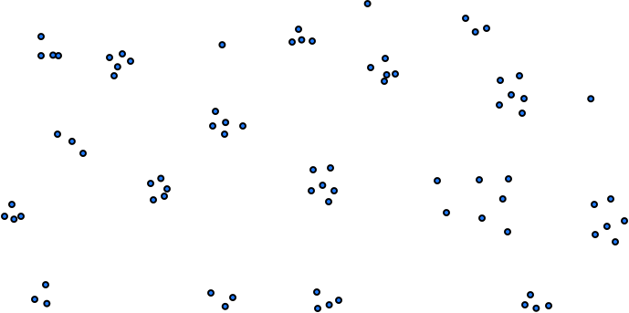
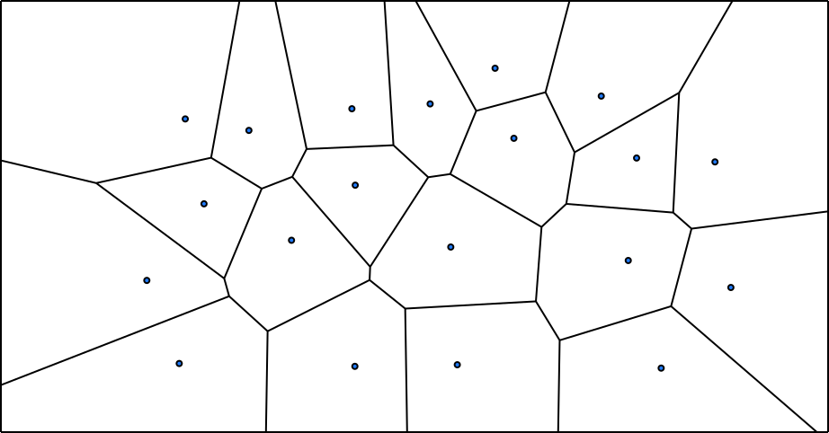
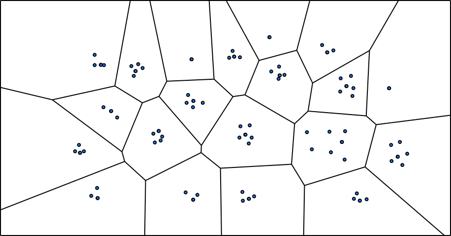
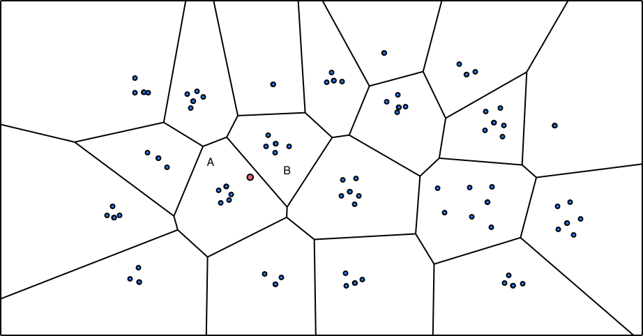
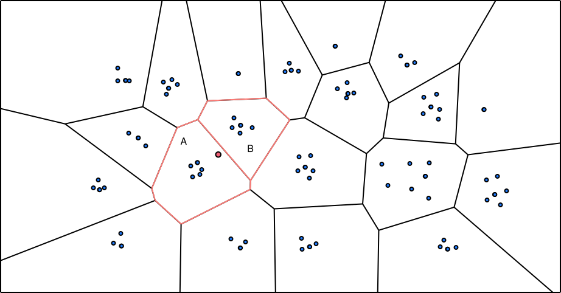

# Narrow the Search with IVFFlat

> **Chapter 2**
>
> Complete [Build an In-Memory Vector Table and Match Its Index](./rust-02-datafusion.md) first. Finish with a seeded
> IVFFlat index, recall measured against exact search, and the same SQL top-k running through `index=ivf_flat`.

IVFFlat is a simple quantization-based vector index that splits data into buckets to accelerate vector similarity search.
A query probes only the nearest buckets, reducing distance calculations at the cost of possibly missing a true neighbor.

## How IVFFlat Works

IVFFlat builds clusters over vectors already stored in the collection. Each cluster has a centroid and a list of the
vectors closest to that centroid. At lookup time, the index compares the query with the centroids first, then searches
only a configured number of nearby lists instead of every vector.

Before the index exists, all points belong to one unpartitioned dataset, so an exact query compares its target with every
point.



At build time, k-means chooses centroids and alternates between assigning vectors to their nearest centroid and moving
each centroid to the mean of its assigned vectors. Each colored region will become one inverted list.



After the last centroid update, assign every vector once more using the final centroids. The result is one list per
centroid, and vectors in the same region will be searched together.



The red vector in the next diagram asks for its nearest neighbors. If lookup searches only its nearest centroid's list,
it can miss a closer point just across the partition boundary:



Probing the next-nearest list exposes those candidates. Increasing the number of probes does more work, but it is less
likely to miss a true neighbor:



## Build IVFFlat in Rust

Chapter 1 left you with an exact SQL path and a `FlatIndex` that checks every vector. You will now build IVFFlat to choose
a smaller candidate set for the same query, then compare its result with exact search.

You will modify:

```text
rust/vector-starter/core/src/ivf.rs
rust/vector-starter/core/src/search.rs        recall_at_k only
```

Keep the Chapter 1 DataFusion rule, public APIs, and tests unchanged. Your work stays in the two files above.

## What Must Hold, and What Breaks If It Doesn't

Your IVF configuration must satisfy `1 <= probes <= partitions <= rows`
with `iterations > 0`. A zero probe count returns an empty result set;
probing more partitions than exist silently wastes work on duplicate scans.

After training, every dataset row must belong to exactly one inverted
list. An orphaned row is invisible to every query; a row in two lists
appears twice with potentially different distances.

Given identical data, metric, configuration, and seed, k-means training
must produce identical centroids and list sizes. A non-deterministic
build makes every recall measurement unreproducible.

Centroid assignment, centroid ranking, and candidate scoring must all
use the same distance metric. Mixing metrics produces a result set
ordered by a criterion the probe loop never optimized.

Searching all partitions must produce the same ordered top-k as the
exact `FlatIndex`. If the exhaustive probe disagrees with the flat
index, the distance computation or the heap is wrong.

Approximate and exact runs for recall measurement must use identical
data, queries, metric, and `k`. Changing any of these between runs
makes the recall number meaningless.

## Checkpoint 1: Measure Recall

Implement `recall_at_k` in `search.rs`. Recall is the fraction of expected top-k row offsets present in the approximate
top-k:

```text
expected = [0, 1, 2]
actual   = [0, 2, 9]
recall@3 = 2 / 3
```

Use row membership, not distance equality or result position. Define recall as `1.0` when the exact denominator is zero;
an empty request has missed nothing.

```sh
cd rust
cargo test -p vector-core-starter --test indexes recall_reports_result_overlap
```

**Prediction:** If exact search returns two rows because the dataset contains two rows while `k = 10`, should the
denominator be 2 or 10? Relate your answer to what the approximate index could possibly return.

## Checkpoint 2: Validate and Seed the Build

Implement `IvfFlatIndex::try_new` in `ivf.rs`. Start by validating the Chapter 2 configuration and calling
`dataset.validate_for_metric(metric)`.

The starter supplies `DeterministicRng`. Use it to shuffle row offsets, then copy the first `partitions` dataset rows as
initial centroids. Sampling distinct offsets avoids beginning with the same row twice.

For a tiny build with six rows and two partitions, the state is:

```text
dataset rows:     0 1 2 3 4 5
seeded centroids: row 4, row 1
assignments:      unknown until the first assignment pass
```

The exact selected rows depend on the seed, but a second build with the same inputs must make the same choice.

## Checkpoint 3: Alternate Assignment and Update

For up to `iterations` rounds:

1. assign every vector to its nearest centroid;
2. stop early if the complete assignment vector did not change;
3. accumulate component-wise sums and counts for each partition; and
4. replace each non-empty centroid with its component-wise mean.

Keep sums in `f64`, as the starter's metric code does for distances. Every nearest-centroid decision uses
`Metric::distance`, including dot and cosine configurations.

```text
repeat up to iterations:
    next_assignments = nearest_centroid(row) for every row
    if next_assignments == assignments:
        stop
    assignments = next_assignments
    recompute each centroid from its assigned rows

rebuild lists once using the final centroids
```

The final rebuild establishes I2. Without it, list membership may describe centroid positions from the previous round.

### Empty and Zero-Mean Clusters

An empty cluster has no mean. Re-seed it from the row farthest from its nearest current centroid; do not divide by zero or
silently remove a partition.

Cosine adds another boundary: nonzero assigned vectors can average to the zero vector. Normalize every nonzero cosine
centroid after the mean. If its norm is zero, replace it with an assigned dataset row, which has already passed Chapter 1's
nonzero-norm validation.

**Prediction:** The mean of `[1, 0]` and `[-1, 0]` is `[0, 0]`. What would cosine distance do with that centroid if you
kept it? Which already validated row can safely replace it?

Run the seeded and zero-mean cases:

```sh
cargo test -p vector-core-starter --test indexes ivf_build_is_seeded
cargo test -p vector-core-starter --test indexes ivf_cosine_recovers_from_a_zero_mean_cluster
```

## Checkpoint 4: Probe Lists at Query Time

Implement `search_with_probes`:

1. validate the query and `1 <= probes <= partitions`;
2. compute one `Neighbor` per centroid and sort centroids nearest-first;
3. visit row offsets from the first `probes` lists;
4. score those dataset rows with the original metric; and
5. feed all candidates into the existing `TopK` and return nearest-first.

Do not return a separate top-k from each list. The SQL query asks for the best `k` across the union of candidates.

Suppose ranked list IDs are `[2, 0, 1]` and their sizes are `[10, 40, 5]`. With `probes = 1`, search reads the five rows
in list 2. With `probes = 2`, it reads those five plus the ten rows in list 0. `k` controls retained output; `probes`
controls which candidates can enter it.

A useful boundary test is to probe every partition. IVFFlat then visits every dataset row and must match exact search,
including tie order:

```sh
cargo test -p vector-core-starter --test indexes ivf_scanning_every_partition_matches_exact_search
```

If this fails, inspect list completeness, metric choice, and final sorting. With every list open, approximation is no
longer an explanation.

## Checkpoint 5: Draw a Recall/Work Curve

The included example creates one deterministic dataset and query set, computes the exact results once with `FlatIndex`,
and reports IVFFlat recall and latency:

```sh
cargo run --release -p vector-core-starter --example recall
```

Change `probes` while keeping the seed, rows, queries, metric, and `k` fixed. Record at least a small-probe point and an
all-partitions point. Timings vary by machine, so compare how candidate work and recall change instead of aiming for a
fixed microsecond target.

As `probes` approaches `partitions`, candidate work approaches exact search and recall must reach `1.0` on the same
deterministic workload.

## Checkpoint 6: Use IVFFlat from SQL

Run the Chapter 2 SQLLogicTest:

```sh
cargo test -p vector-datafusion-starter --test sqllogictest day2_ivfflat_sql
```

The SQL text and the matcher you implemented in Chapter 1 are unchanged. Only `IndexConfig` changes:

```text
SortExec: TopK(fetch=5), ...
  VectorIndexScanExec: index=ivf_flat, metric=Euclidean, query_dim=3, fetch=Some(5), ordered=false
```

DataFusion passes `LIMIT 5` through Chapter 1's `with_fetch`. `VectorIndexScanExec` calls `IvfFlatIndex::search`, which uses
the configured `probes`. The generic bounded sort remains responsible for final SQL ordering. Unsupported query shapes
still use the exact `VectorScanExec` path.

## Review Your Chapter 2 Result

After the four Chapter 2 core tests, recall example, and Chapter 2 SQLLogicTest pass, choose one concrete build and query
and explain:

- why list membership must be rebuilt after the final centroid update;
- how a dataset row flows from assignment to a probed list to `TopK`;
- why empty and zero-mean cosine clusters need different recovery logic;
- why probing every list is an exactness test; and
- how Chapter 1's optimizer rule reaches a new index without changing its safety contract.

Keep this checkpoint focused on in-memory IVFFlat. Persistent postings, online centroid retraining, product quantization,
and reproducible latency targets remain outside this chapter.

{{#include copyright.md}}
