# Navigate a Proximity Graph with NSW

{{#include rust-in-progress.md}}

> **Day 3**
>
> Complete [Narrow the Search with IVFFlat](./rust-03-ivfflat.md) first. You will replace centroid/list selection with graph
> reachability while keeping the SQL matcher, row lookup, and final top-k sort supplied.

## Start from the Product You Already Have

Day 2 ended with one five-row table and one SQL query running through IVFFlat. Run it again from the repository
root:

```sh
cargo run -p vector-db-from-scratch-datafusion-starter --example ivfflat_sql
```

The seeded IVFFlat plan contains `index=ivf_flat`, and its `LIMIT 3` result is:

```text
(1, one)
(2, two)
(3, three)
```

Day 3 keeps that query and fixture fixed. What changes is how the core index proposes candidate row offsets:
IVFFlat probes centroid lists, while navigable small world (NSW) search follows edges in a proximity graph. DataFusion's
bounded `SortExec` still owns final SQL ordering.

The cumulative starter already contains these two files:

```text
vector-db-starter/core/src/graph.rs
vector-db-starter/core/src/nsw.rs
```

You own four TODOs:

1. `search_layer`;
2. `prune_neighbors`;
3. `NswIndex::try_new`; and
4. `NswIndex::search_with_ef`.

The same starter also declares `greedy_search`, HNSW, and IVF-PQ surfaces for later days. Leave those future TODOs
alone. The supplied crate-internal tests let you finish one NSW boundary at a time without making graph helpers public.

## Checkpoint 1: Search One Supplied Layer

An NSW graph has no centroid that points directly at the query. Search begins from one or more entry points and explores
their connected neighbors.

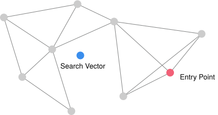

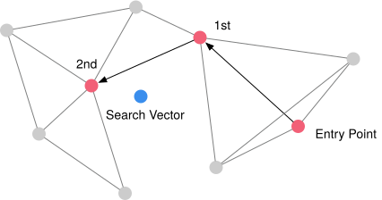

For top-k search, keep three pieces of state:

- `C`, a min-heap whose nearest candidate is the next vertex to expand;
- `W`, a bounded max-heap whose top is the worst retained result; and
- `visited`, a set that prevents a row from being measured or expanded twice.

Seed all three from the valid, unique entry points.

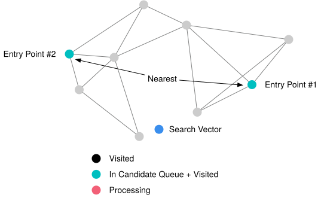

Pop the nearest item from `C`. For each unseen neighbor, compute its distance once. If it can improve `W`, add it to
both frontiers and trim `W` back to the search width.

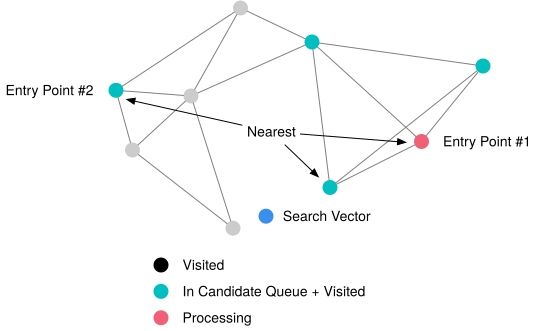

A candidate may add nothing because all its neighbors were already visited. Other pending candidates can still continue
the search.

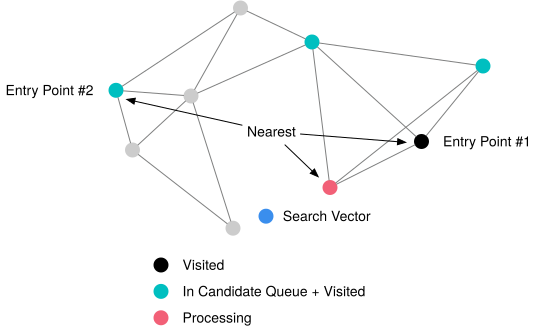

Multiple entry points can reach different graph regions, but no heap width can cross a disconnected component without an
entry point or edge into it.

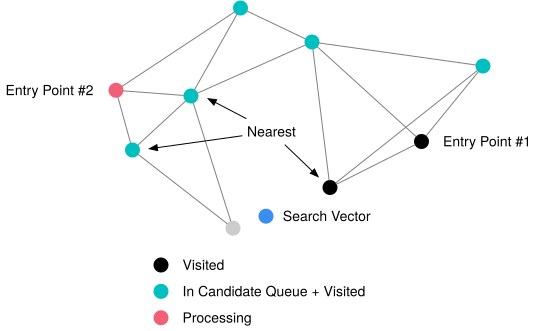

`W` retains only the nearest vertices found within the current width.

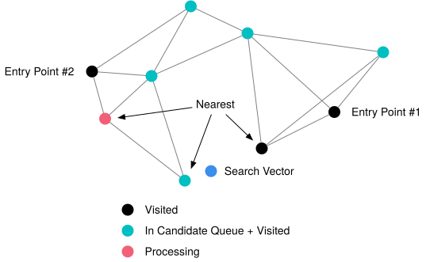

When `W` is full and the nearest pending candidate is **strictly worse** than `W.worst`, this bounded NSW search stops.

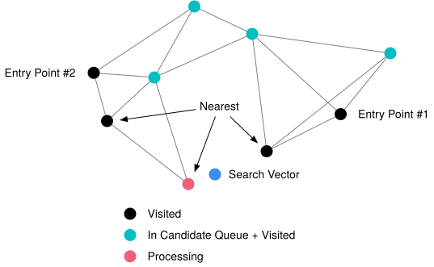

The strict comparison matters. A candidate equal to `W.worst` must still be expanded. This stopping rule limits work; it
does not prove that every unseen path is worse, because a worse intermediate vertex could lead to a closer vertex later.

```text
C = valid unique entry points as a min-heap by distance
W = the same points as a bounded max-heap by distance
visited = the same row offsets

while C is not empty:
    candidate = C.pop_nearest()
    if W is full and candidate is strictly worse than W.worst:
        break

    for neighbor in candidate.neighbors:
        if neighbor is outside allowed_rows or already visited:
            continue
        mark neighbor visited
        measure its distance once
        if W is not full or neighbor is better than W.worst:
            C.push(neighbor)
            W.push(neighbor)
            trim W to the search width

return W from nearest to farthest
```

Implement `search_layer` in `graph.rs`. Clamp `ef` to at least one and at most `allowed_rows`; return no rows when
none are allowed. Ignore duplicate or out-of-range entry points. During insertion, `allowed_rows = r` means only
previous rows `0..r` exist.

Run only this checkpoint's supplied test:

```sh
cargo test -p vector-db-from-scratch-core-starter \
  graph_tests::day_03_search_layer_respects_bounds_and_expands_equal_frontier -- --exact
```

Before the implementation it reaches the Day 3 traversal TODO. Afterward it checks allowed rows, disconnected
components, duplicate and invalid entry points, nearest-first uniqueness, and the strict-worse stopping boundary.

**Prediction:** If every entry point is in one of two disconnected components, why can increasing `ef` not return a row
from the other component?

## Checkpoint 2: Keep a Bounded Neighbor List

Rows are inserted one at a time. Search the graph built so far with width `ef_construction`, then choose at most
`max_connections` neighbors for the new row.

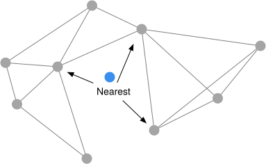

Adding reciprocal edges can push an existing endpoint over the degree cap.

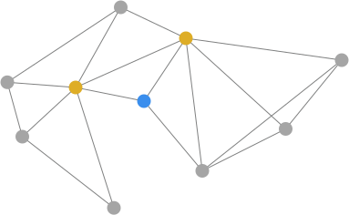

Implement `prune_neighbors` in `graph.rs`. Deduplicate the supplied neighbor rows, order them by distance from the
owner, break distance ties by row offset, and truncate to `max_connections`.

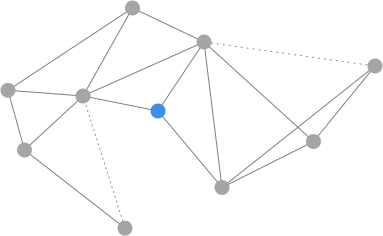

Run the crate-internal helper test:

```sh
cargo test -p vector-db-from-scratch-core-starter \
  graph_tests::day_03_prune_neighbors_is_deterministic_and_bounded -- --exact
```

Its direct fixture is self-free and isolates deduplication, ordering, tie-breaking, and the cap. The graph builder—not
this synthetic helper input—owns the invariant that no adjacency list contains its own row.

## Checkpoint 3: Build a Reciprocal Graph

Implement `NswIndex::try_new` in `nsw.rs`.

Validate stored vectors for the selected metric before building. The graph budget must satisfy:

- `max_connections > 0`;
- `ef_construction >= max_connections`; and
- `ef_search > 0`.

Add the first row without searching. For each later row `r`, search only `0..r`, add reciprocal edges to the selected
neighbors, and prune every affected endpoint. If pruning removes `a -> b`, also remove `b -> a`.

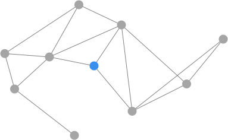

The completed graph must be deterministic, duplicate-free, self-free, reciprocal, and within the configured degree cap.
Run its focused construction test:

```sh
cargo test -p vector-db-from-scratch-core-starter --test indexes \
  day_03_nsw_rejects_invalid_build_configuration_and_builds_a_bounded_reciprocal_graph -- --exact
```

This test owns stored-vector and configuration validation plus the built-graph invariants. It does not require
`search_with_ef`.

## Checkpoint 4: Query with a Width Budget

Implement `NswIndex::search_with_ef`.

Validate the query for dimension, finite values, and the selected metric. Reject a zero search width. Search from the
graph entry point with `ef_search.max(k)`, return at most `k` rows, and keep them nearest-first.

The `.max(k)` floor separates the requested result count from the caller's exploration hint: asking for five rows with
`ef_search = 1` still needs a result frontier that can hold five rows.

Run the query test:

```sh
cargo test -p vector-db-from-scratch-core-starter --test indexes \
  day_03_nsw_search_validates_widens_and_matches_exact_on_connected_fixture -- --exact
```

It checks query validation, zero width, the `ef_search.max(k)` floor, ordering, and one connected high-width fixture that
matches `FlatIndex`. That equality is an observation about this fixture, not a claim that NSW is exact for arbitrary
data, widths, or disconnected graphs.

## Return to the Same SQL Product

Now run the supplied, TODO-free comparison:

```sh
cargo run -p vector-db-from-scratch-datafusion-starter --example nsw_sql
```

It executes the same five-vector cosine query twice. The first plan contains:

```text
VectorIndexScanExec: index=ivf_flat, metric=Cosine, query_dim=3, fetch=Some(3), ordered=false
```

The second contains:

```text
VectorIndexScanExec: index=nsw, metric=Cosine, query_dim=3, fetch=Some(3), ordered=false
```

Both retain the supplied `SortExec` and show the same three rows:

```text
(1, one)
(2, two)
(3, three)
```

The example demonstrates the Day 2 → Day 3 handoff through the existing attachment, matcher, source-row lookup,
and final sort. Equal rows here do not establish general recall, work, or performance.

Keep the separate five-result SQL fixture green:

```sh
cargo test -p vector-db-from-scratch-datafusion-starter --test sqllogictest day_03_nsw_sql -- --exact
```

That SQLLogicTest uses a different eight-row fixture and `LIMIT 5`. It verifies `index=nsw`, the supplied final sort,
and its own five expected rows. Unsupported SQL shapes continue to use the supplied exact path.

## Day 3 Review

Run the Day 3 focused gate, then the cumulative course through Day 3:

```sh
cargo x test-day 3
cargo x test-through 3
```

Choose one insertion and one query and explain:

- why `C` and `W` need opposite heap orderings;
- why the stopping comparison is strict;
- how a rejected edge is removed from both endpoints;
- why `ef_search.max(k)` is necessary; and
- why a disconnected component remains unreachable without an entry point or edge into it.

Keep Day 3 to one immutable graph layer. Hierarchy, deletion, concurrent mutation, persistence, filtered pushdown,
general DDL/catalog behavior, benchmarking, and neighbor-diversification heuristics belong outside this checkpoint.

{{#include copyright.md}}
