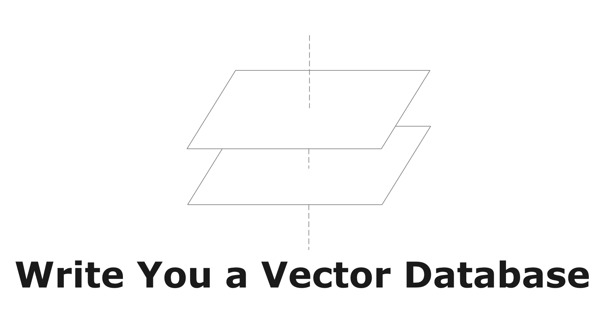

# Introduction



In this tutorial, you will learn how to add vector extensions to an existing relational database system.

## Vector Databases

Vector databases store vectors, and vectors are arrays of decimal values. Vector databases support efficient query and retrieval of vector data by storing vectors with compact format and creating vector indexes to accelerate similarity searches. Vector databases can be either a vector-oriented standalone database product that provides the above functionalities (i.e., Pinecone and Milvus), or a relational/NoSQL database system with vector extensions (i.e., PostgreSQL with pgvector, or Elasticsearch with vector searches).

Diving a little bit into PostgreSQL with [pgvector](https://github.com/pgvector/pgvector), the extension adds the following vector capabilities on top of PostgreSQL.

```sql
CREATE TABLE items (id bigserial PRIMARY KEY, embedding vector(3)); -- vector type
SELECT * FROM items ORDER BY embedding <-> '[3,1,2]' LIMIT 5; -- computing nearest neighbors
CREATE INDEX ON items USING hnsw (embedding vector_l2_ops); -- create vector indexes
```

We will implement the same functionalities in this tutorial.

## About This Tutorial

We have two variants of this tutorial: the C++ version is based on CMU-DB's BusTub system (used in [CMU's Database Systems course](https://15445.courses.cs.cmu)), and the to-be-expected Rust version will be based on the RisingLight educational database system. Both of them are (1) relational DBMS that users can interact with using ANSI SQL interfaces (2) educational systems that are super easy to get started and do hands-on works. You will learn how to store the vectors, do similarity searches by computing nearest neighbors, and build vector indexes like IVFFlat and HNSW over the data throughout this tutorial.

We provide full solution for this tutorial on the `vectordb-solution` branch at [https://github.com/skyzh/bustub-vectordb](https://github.com/skyzh/bustub-vectordb) except the part of the tutorial that overlaps with CMU-DB's Database Systems course.

<div class="warning">

Some part of this tutorial overlaps with Carnegie Mellon University's Database Systems course. Please follow the instructions in the tutorial on whether you can make some specific part of your implementation public on the Internet.

</div>

There are many other vector database tutorials on the Internet. The primary features of this tutorial: we focus on building a vector extension on a relational database system (instead of REST APIs or some other interfaces), and we focus on the implementation of the vector indexes (instead of directly using the Faiss library).

## Prerequisites

You will need to know the basics of relational database systems and have some experience of system programming before starting this tutorial. You *do not* need to have a solid experience with database systems (i.e., complete the 15-445/645 Database Systems course). We assume you do not know much about the internals of the database systems and will have necessary contents to guide you through the system in the tutorial.

To complete the C++ version of this tutorial, you will need to know modern C++. The BusTub system is written in C++17 and you should feel comfortable with working on a C++17 codebase. You can quickly learn the necessary C++17 features that we will use in this tutorial by completing the [C++ primer](https://15445.courses.cs.cmu.edu/fall2023/project0/) project of CMU-DB's Database Systems course.

To complete the Rust version of this tutorial, you will need to know Rust and feel comfortable with working on a Rust codebase.

## Community

You may join skyzh's Discord server and study with the write-you-a-vector-db community.

[](https://skyzh.dev/join/discord)

## About the Author

As of writing (at the beginning of 2024), Chi obtained his master's degree in Computer Science from Carnegie Mellon University and his bachelor's degree from Shanghai Jiao Tong University. He has been working on a variety of database systems including [TiKV][db1], [AgateDB][db2], [TerarkDB][db3], [RisingWave][db4], and [Neon][db5]. Since 2022, he worked as a teaching assistant for [CMU's Database Systems course](https://15445.courses.cs.cmu) for three semesters on the BusTub educational system, where he added a lot of new features and more challenges to the course (check out the re-designed [query execution](https://15445.courses.cs.cmu.edu/fall2022/project3/) project and the super challenging [multi-version concurrency control](https://15445.courses.cs.cmu.edu/fall2023/project4/) project). Besides working on the BusTub educational system, he is also a maintainer of the [RisingLight](https://github.com/risinglightdb/risinglight) educational database system. Chi is interested in exploring how the Rust programming language can fit in the database world. Check out his previous tutorial on building a vectorized expression framework [type-exercise-in-rust](https://github.com/skyzh/type-exercise-in-rust) and on building a LSM-based storage engine [mini-lsm](https://github.com/skyzh/mini-lsm) if you are also interested in that topic.

[db1]: https://github.com/tikv/tikv
[db2]: https://github.com/tikv/agatedb
[db3]: https://github.com/bytedance/terarkdb
[db4]: https://github.com/risingwavelabs/risingwave
[db5]: https://github.com/neondatabase/neon


<div class="warning">

Disclaimer: This tutorial is not affiliated with Carnegie Mellon University or CMU-DB Group. The C++ version of this tutorial is NOT a part/extension of CMU's 15-445/645 Database Systems course.

</div>

{{#include copyright.md}}
