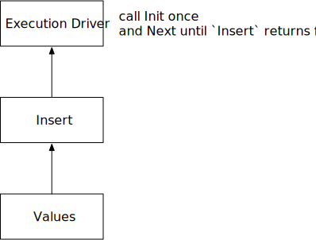

# Vector Expressions and Storage

In this chapter, we will walk through some ramp-up tasks to get familiar with the BusTub system. You will be able to store vectors inside the system and compute vector distances after finishing all required tasks.

The list of files that you will likely need to modify:

```
src/execution/insert_executor.cpp                    (recommended to git-ignore)
src/execution/seq_scan_executor.cpp                  (recommended to git-ignore)
src/include/execution/executors/insert_executor.h    (recommended to git-ignore)
src/include/execution/executors/seq_scan_executor.h  (recommended to git-ignore)
src/include/execution/expressions/vector_expression.h
```

<div class="warning">

**WARNING:** In this tutorial, you will implement a simplified version of the sequential scan and the insert executor. These implementations are different from the 15-445 course but we still recommend you not including these files in your git repository.

</div>

## Computing Distances

In `vector_expressions.h`, you can implement some distance functions that we will use when building vector indexes and finding the k-nearest neighbors. You will need to implement 3 distance functions in `ComputeDistance`.

**L2 distance (or Euclidean distance)**

\\( = \lVert \mathbf{a} - \mathbf{b} \rVert = \sqrt {(a_1 - b_1)^2 + (a_2 - b_2)^2 + \cdots + (a_n - b_n)^2} \\)

**Cosine Similarity Distance** 

\\( = 1 - \frac { \mathbf{a} \cdot \mathbf{b} } {\lVert \mathbf{a} \rVert \lVert \mathbf{b} \rVert} = 1 - \frac { a_1 b_1 + a_2 b_2 + \cdots + a_n b_n} { \sqrt { a_1^2 + \cdots + a_n^2 } \sqrt { b_1^2 + \cdots + b_n^2 } } \\)

**Negative Inner Product Distance**

\\( = - \mathbf{a} \cdot \mathbf{b} = - ( a_1 b_1 + a_2 b_2 + \cdots + a_n b_n ) \\)

## Insertion and Sequential Scan

In this task, you will learn how BusTub represents data and how to interact with vector indexes.

### Table Heap and Tuple Format

In BusTub, all table data are stored in a structure called table heap. The table heap is row-based storage that stores a collection of tuples on the disk. See the `TableHeap` class for more information.

A tuple is a serialized representation of a row in the database. For example, a tuple of integer `1, 2, 3` will be serialized into a tuple with hex representation of:

```
01 00 02 00 03 00
```

This serialized data will be stored on disk. To recover the values from the serialized value, you will need to provide a schema. For example, the schema for 3 integers is `[Int, Int, Int]`. With the schema, we can decode the tuple to three integer values.

In BusTub, there are 3 important data-representation structures.

* `Tuple`: as above, serialized bytes that represent some values.
* `Schema`: as above, number of elements and the data type of each element, indicating the correct way to decode the tuple.
* `Value`: an in-memory representation of a value with type information, where users can convert it to a primitive type.

*Related Lectures*

* [Database Storage Part 2 (CMU Intro to Database Systems)](https://www.youtube.com/watch?v=Ra50bFHkeM8&list=PLSE8ODhjZXjbj8BMuIrRcacnQh20hmY9g&index=5)

### Execution Model

BusTub uses the Volcano execution model. Each query executor defines an `Init` and a `Next` member functions. The query executors are organized in a tree. The top-most execution driver (see `execution_engine.h`) will call `Init` once and `Next` until the top-most executor returns false, which indicates there are no more tuples to be produced. Each executor will initialize and retrieve the next tuple from their child executors.



*Related Lectures*

* [Query Execution Part 1 (CMU Intro to Database Systems)](https://www.youtube.com/watch?v=3F3FWgujN9Q&list=PLSE8ODhjZXjbj8BMuIrRcacnQh20hmY9g&index=13)
* [Query Execution Part 2 (CMU Intro to Database Systems](https://www.youtube.com/watch?v=MUjS0tIDnEE&list=PLSE8ODhjZXjbj8BMuIrRcacnQh20hmY9g&index=14)

### Insertion

SQL queries like `INSERT INTO` will be converted into an insert executor in the query processing layer.

```
bustub> explain (o) insert into t1 values (array [1.0, 2.0, 3.0]);
=== OPTIMIZER ===
Insert { table_oid=24 }
  Values { rows=1 }
```

We have already provided the implementation of values executor that produces the user-provided values in the insert statement. You will need to implement the insert executor. The insert executor should do all the insertion works in the `Init` function and return a single number indicating rows processed in the `Next` function.

You will also need to get all vector indexes from the catalog (using the executor context), and insert the corresponding data into the vector index. All vector indexes can be dynamically casted to `VectorIndex*`. You can use `index->GetKeyAttrs()` to retrieve the vector column to build index on, and it should always be one column of vector type. After you know which column to build the index, you can extract the `Value` from the child executor (values) output tuple, and then use `Value::GetVector` to convert it to a `std::vector<double>` vector. With that, you may call `index->InsertVectorEntry` to insert the data into vector indexes.

You can get necessary information (i.e., table oid) from the query plan.

### Sequential Scan

In sequential scan, you may create a table iterator and store it in the executor class in `Init`, and emit tuple one by one in `Next`. You do not need to consider the case that a tuple might have been deleted. In this tutorial, all tables are append-only.

You may get the table heap structure by accessing the catalog using executor context. After getting the table heap, you may create a table iterator by using `MakeIterator`. You may retrieve the current tuple pointed by the iterator by calling `TableIterator::GetTuple`, and move to the next tuple by using prefix `++` operator. `TableIterator::IsEnd` indicates whether there are more tuples in the table heap.

You can get necessary information (i.e., table oid) from the query plan.

## Testing

You can run the test cases using SQLLogicTest.

```
make -j8 sqllogictest
./bin/bustub-sqllogictest ../test/sql/vector.01-insert-scan.slt --verbose
```

The test cases do not do any correctness checks and you will need to compare with the below output by yourself. Note that we do not test index insertions for now, and you can validate if your implementation of index insertion is correct in later tasks.

<details>

<summary>Reference Test Result</summary>

```
{{#include vector.01-insert-scan.slt.ref}}
```

</details>

## Bonus Tasks

At this point, you should have implemented the basic read and write flows when a user requests to store some data in the system. You may choose to complete the below bonus tasks to challenge yourself.

**Implement the Buffer Pool Manager**

We already provide you a mock buffer pool manager and a table heap so that you do not need to interact with the disk and persist data to the disk. You can implement a real buffer pool manager based on [project 1](https://15445.courses.cs.cmu.edu/fall2023/project1/) of 15-445/645. Remember to revert both the buffer pool manager change and the table heap change before starting implementing the project, otherwise there will be memory leaks and deadlock issues.

**Implement Delete and Update**

You may implement the delete and update executor to update the data in the table heap and the vector indexes. When you delete or update an entry, BusTub does not actually remove the data from the table heap. Instead, it sets the deletion marker. Therefore, you can use the `UpdateTupleMeta` function when deleting a record, and convert update to a deletion followed by an insertion. Also remember to update the vector indexes if you implement these two executors. You might need to add new member functions to `VectorIndex` class to remove data from vector indexes.

**Insert Validation**

It is possible that a user might insert a vector of dimension 3 or 5 to a `VECTOR(4)` column. In insertion executor, you may do some validations to ensure the received tuples are of the correct schema.

*Again, please keep your implementation in this section private and do not put them in a public repo, especially if you want to approach the bonus tasks, because they overlap with the CMU-DB's Database Systems course projects.*
