# NSW (Navigable Small Worlds) Index


Before building the so-called HNSW (Hierarchical Navigable Small Worlds) index, we will start with the basic component of the HNSW index -- NSW (Navigable Small Worlds). In this chapter, we will build a graph-based index structure for vectors.

The list of files that you will likely need to modify:

```
src/include/storage/index/hnsw_index.h
src/storage/index/hnsw_index.cpp
```

*Related Readings*

* [Efficient and robust approximate nearest neighbor search using Hierarchical Navigable Small World graphs](https://arxiv.org/abs/1603.09320)
* [Hierarchical Navigable Small Worlds (HNSW) from Pinecone's Faiss Manual](https://www.pinecone.io/learn/series/faiss/hnsw/)

## Overview

In NSW, you start from one or more entry points, and greedily visit the neighbors to find a point closer to the search vector. At some point, when there are no nearer point to explore, the search can be stopped and the approximate nearest neighbors are returned.

## Layer Search

**One Entry Point, 1-Nearest Neighbor**

Let us start with searching exactly one nearest neighbor within an NSW graph of one entry point. Assume we have already built an NSW index over the below vectors in a 2-dimension space. The layer has one entry point as indicated in the figure in red color.

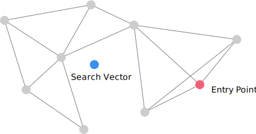

An intuitive way to find the nearest neighbor is to find a closer point to the search vector in all the neighbors as below.

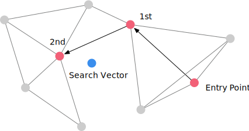

By greedily move to a vector closer to the search target, we will likely find the nearest neighbor.

**Multiple Entry Points, k-Nearest Neighbors**

Now let us move forward and find 3 nearest neighbors with 2 entry points in the following NSW index. The full NSW algorithm maintains 2 data structures: an explore candidate priority queue and a result binary heap. The explore candidate priority queue maintains the candidate vectors to visit. The top element in the queue is the current to-be-explored nearest node. The result set is a binary heap as in the top-k executor. It is a max-heap and maintains the k-nearest neighbors across all vectors that we have visited.

Before exploring, we add the entry points to both the explore candidate priority queue `C` and the result set `W`.

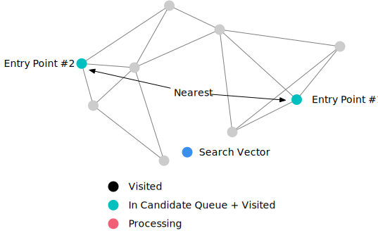

Then, we pop the nearest vector (which is entry point #1) to explore from `C` queue, and add all its neighbors to the `C` queue and the `W` set. The `W` set only maintains the k-nearest neighbors and therefore it will not have more then 3 elements.

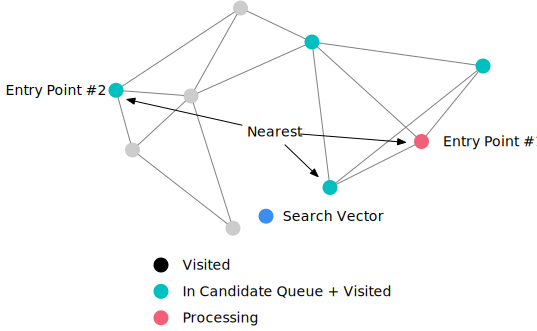

In the next iteration, we pop the nearest vector (which is the red point as below) from the `C` queue. All its neighbors have been visited, so we do not add more elements to the candidate explore queue.

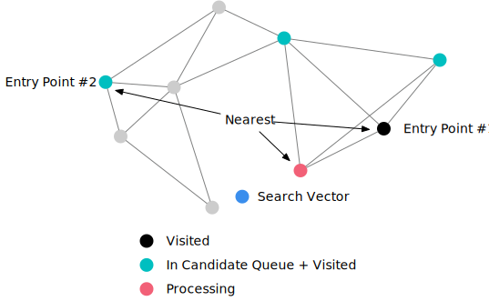

Then, we pop the next vector from the `C` queue, which is entry point #2. We add all its neighbors to `C` and update `W`.

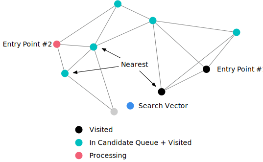

After that, we continue to explore the vector as indicated below.

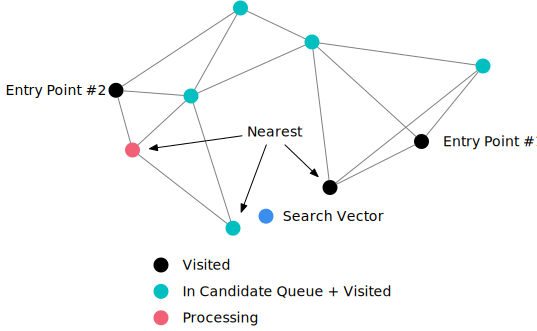

When we reach the vector as below, all vectors in the candidate explore queue have larger distance to the search vector than the vectors in the result set. Therefore, we can stop searching at this point.

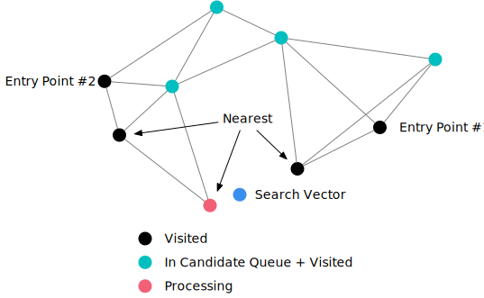

**Why we need multiple entry points**

Still consider the above example, if we want to find the 2-nearest neighbors and only have 1 entry point, the search algorithm will stop at the below status.

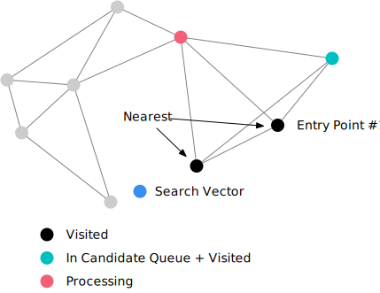

At this point, all candidates in the `C` queue have larger distance than all vectors in the result set. It reaches the search end condition and will not be able to explore the actual nearest neighbors.

**Pseudo Code**

```
C <- entry_points as min heap on distance
W <- entry_points as max heap on distance
visited <- entry_points as unordered set
while not C.empty():
    node <- pop C (nearest element in C)
    if dist(node) > dist(top W): # top W is the furthest element in W
        break
    for neighbor in neighbors of node:
        if not visited neighbor:
            visited += neighbor
            C += neighbor
            W += neighbor
            retain k-nearest elements in W
return W
```

The pseudo code is the same as in the HNSW paper. The input parameters for this algorithm are:

* limit: number of neighbors to search. Keep at most this number of elements in the result set.
* base_vector: the search target.
* entry_points: the entry points.

You may implement the search layer functionality in `NSW::SearchLayer`. By default, the starter code uses the first vertex inserted into a layer as the entry point. You may also implement the algorithm to randomly sample multiple entry points.

## Insertion

Insertion follows the same process as layer search. We simply find the k-nearest neighbors of the to-be-inserted vector in a layer, and add edges from the inserting vector to the neighbors. For example, we want to establish 3 connections, where the number 3 is the `m` parameter of the index, and therefore we find 3 nearest neighbors to the blue vector as below.

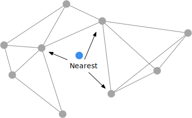

Now we add edges between the vector and the neighbors. However, the two yellow points now have too many connections, controlled by the `max_m` parameter. This may make the search layer process slower. Therefore, we need to cut down number of connections after adding more edges.

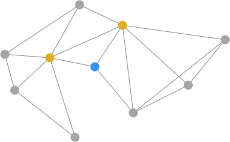

To cut down the conections, we simply re-compute the k-nearest neighbors of the two yellow nodes, where `k = max_m`.

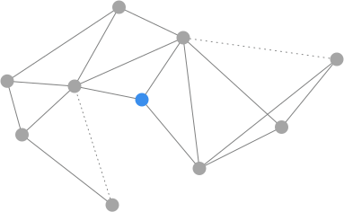

And we only keep the k-nearest neighbor connections after inserting the new vector.

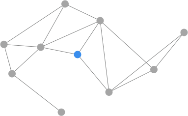

## Implementation

You may implement the NSW index in `hnsw_index.cpp` at this point. The starter code implements the HNSW index class as a one-layer index, which is equivalent to the NSW index.

## Testing

At this point, you can run the test cases using SQLLogicTest.

```
make -j8 sqllogictest
./bin/bustub-sqllogictest ../test/sql/vector.05-hnsw.slt --verbose
```

The test cases do not do any correctness checks and you will need to compare with the below output by yourself. Your result could be different from the reference solution because of random stuff (i.e., random seed is different). You will need to ensure all nearest neighbor queries have been converted to a vector index scan.

<details>

<summary>Reference Test Result</summary>

```
{{#include vector.05-hnsw.slt.1.ref}}
```

</details>
