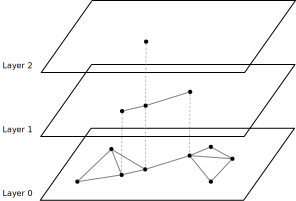

# HNSW (Hierarchical Navigable Small Worlds) Index

Now that we built NSW indexes in the previous chapter, we can now have multiple layers of NSW indexes and add hierarchy to the index structure to make it more efficient.

The starter code for this part is ready but the write-up is still working-in-progress.

The list of files that you will likely need to modify:

```
src/include/storage/index/hnsw_index.h
src/storage/index/hnsw_index.cpp
```

*Related Readings*

* [Efficient and robust approximate nearest neighbor search using Hierarchical Navigable Small World graphs](https://arxiv.org/abs/1603.09320)
* [Hierarchical Navigable Small Worlds (HNSW) from Pinecone's Faiss Manual](https://www.pinecone.io/learn/series/faiss/hnsw/)

## Overview

HNSW adds layered structure to the NSW index, therefore making the search process faster. The idea is similar to the skiplist data structure or mipmaps in computer graphics. The bottom-most level 0 NSW layer contains all information, and we randomly put some vectors to the upper layer (more upper layer has fewer elements), which are also NSW indexes. The search process starts from the upper-most layer, and uses neighbors in that layer as the entry points of the lower layer.



## Testing

At this point, you can run the test cases using SQLLogicTest.

```
make -j8 sqllogictest
./bin/bustub-sqllogictest ../test/sql/vector.05-hnsw.slt --verbose
```

The test cases do not do any correctness checks and you will need to compare with the below output by yourself. Your result could be different from the reference solution because of random stuff (i.e., random seed is different). You will need to ensure all nearest neighbor queries have been converted to a vector index scan.

<details>

<summary>Reference Test Result</summary>

```
{{#include vector.05-hnsw.slt.2.ref}}
```

</details>
